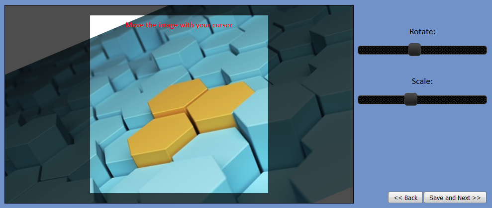

# yaic (yet another image clipper)

Takes a (css transformed) image and clips it to to a given area.

## Quick start

```bash
npm install yaic
bower install yaic
```

```html


<script src="yaic.js"></script>

<script>
    // returns a HTMLCanvasElement
    var canvas = yaic(
        document.getElementById('myPic'),
        {
            // width and height of the clipping area
            width: 200,
            height: 200,
            
            // width and height of resulting image
            targetWidth: 500
            targetHeight: 500
            
            // translation of clipping area
            x: 50,
            y: 50
        }
    )
  
    // do something with clipped image e.g. upload the blob
    canvas.toBlob(function(blob){
        // upload blob
    })
</script>

<!-- for jQuery support see this one -->
<script>
    var canvas = $('#myPic').yaic({
        width: 200,
        height: 200,
        targetWidth: 500
        targetHeight: 500
        x: 50,
        y: 50
    })
</script>
```

## Parameter

the yaic function takes 2 Parameter:

- img: instance of HTMLImageElement or Javascript Image Object
- area: object with the following properties
    - width: width of the clipping area
    - height: height of the clipping area
    - targetWidth: width of resulting image
    - targetHeight: height of resulting image
    - x: translation of clipping area
    - y: translation of clipping area
    
**Note:** `targetWidth` and `targetHeight` can be dropped. yaic then calculates the clipping area without scaling the orginal image at all which means you get the best possible quality.  
Make sure, the ratio of `width/height` equals the ratio of `targetWidth/targetHeight`.

yaic does not support skew!

## Use case



### Result: 
